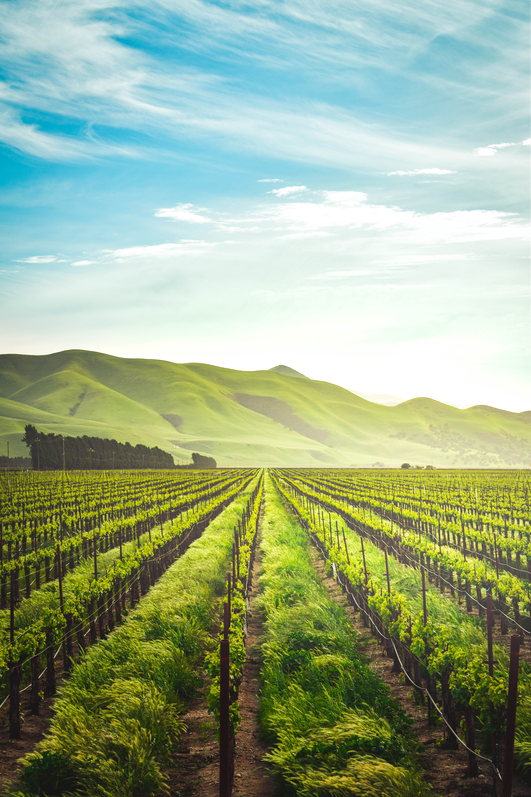

# Simplon's Skills Farming

:point_right: Vous pouvez retrouver la [dernière maquette Figma ici](https://www.figma.com/file/sxHkQE8ntzhyIBLPfE2IU5/skills-tree).

:mag_right: **Description de l'application**

> L'arbre de talent a pour but de centraliser tous les modules ainsi que toutes les compétences du référentiel CDA.
> Chaque apprenant doit pouvoir situer son niveau par rapport aux différentes compétences du référentiel.
> Chaque apprenant doit pouvoir se situer par rapport au niveau global de la promotion.

## TODO-LIST

### :closed_book: TODO

**[PREVIEW]**

- Charte graphique

**[BACK]**

- Développer des composants dans le langage d'une base de données, back-end, multi-couche, composant métier **:two:**
  - Node, Express, MySQL
- Préparer et exécuter les plans de tests d'une application **:two:**
  - utilisation de Postman
  - afficher les requêtets et les résultats des fonctionnalités énoncés dans le sujet

**[FRONT]**

- Développer une interface **:two:**
  - mise en place d'une architecture
  - bundler
  - mise en place des bonnes pratiques de conception
  - intégration des maquettes

### :orange_book: DOING

- Maquetter une application **:two:**
  - utilisation de Figma
  - création de wireframes / maquettes
- Mettre en place une base de données **:two:**
  - utilisation du SGBD MySQL
  - utilisation d'un outil de gestion de base de données: PhpMyAdmin / Workbench

### :green_book: DONE

- MCD [tool]
- MPD [tool]

---

## :scroll: ENTITIES

| FARMERS    | THEMES      | SKILLS      | LEVELS      | FARMERS_SKILLS_LEVELS | FARMERS_SKILLS_TIPS |
| ---------- | ----------- | ----------- | ----------- | --------------------- | ------------------- |
| ID         | ID          | ID          | ID          | ID                    | ID                  |
| EMAIL      | NAME        | NAME        | NAME        | FARMER_ID             | FARMER_ID           |
| FIRST_NAME | DESCRIPTION | DESCRIPTION | DESCRIPTION | SKILL_ID              | SKILL_ID            |
| LAST_NAME  |             | THEME_ID    |             | LEVEL_ID              | TIP_NAME            |
| PASWWORD   |             |             |             |                       | TIP_CONTENT         |

---

## :star2: TEAM

:email: cabanes.thibault@gmail.com
:email: lilian.mahut@pm.me

---

## UTILS

### Background-Image:

_background-image source: https://unsplash.com/photos/2oYMwuFgnTg_
